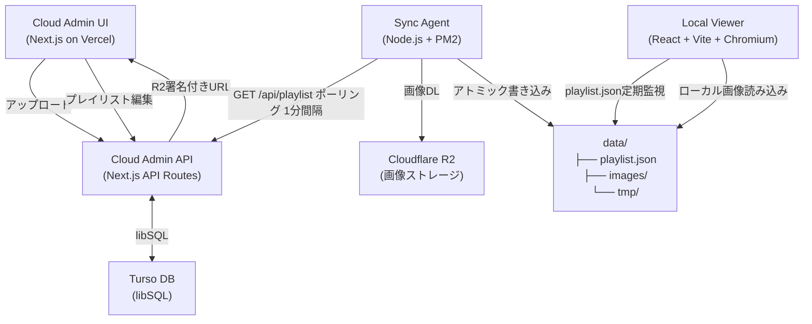
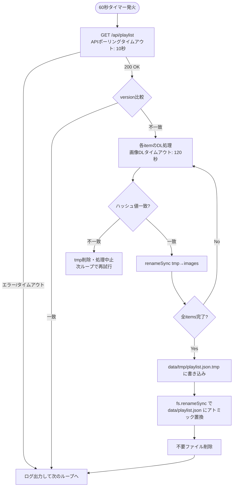
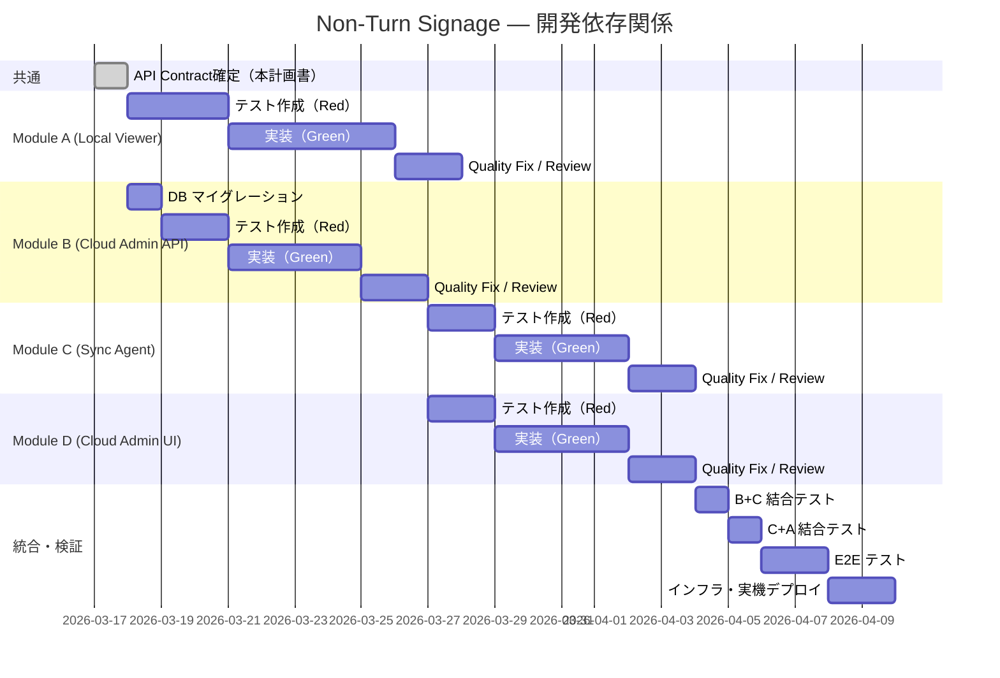

# Non-Turn Signage System — 実装計画書

作成日: 2026-03-17
バージョン: 1.1.0
v1.1.0: アーキテクトレビュー（Opus）指摘事項 CRITICAL 6件 + INFORMATIONAL 3件を反映

---

## 1. プロジェクト概要

### 1.1 システムの目的

Ubuntu端末上で動作する完全自律型のデジタルサイネージシステム。
高解像度の商業写真素材の構図を完全に保持しつつ、オフライン環境下でも絶対に停止しない堅牢な再生環境を構築する。

### 1.2 コアバリュー

> 「重い画像を、構図を崩さず（パターンCのぼかし背景）、カクつくことなく美しくフェードさせること」

すべての技術判断はこの価値を守るために行う。

### 1.3 技術スタック一覧

| レイヤー | 技術 | 用途 |
|---------|------|------|
| Local Viewer FE | React + Vite + TypeScript | ローカル端末での再生UI |
| Local Viewer 状態管理 | Zustand | プレイリスト状態・フェード状態管理 |
| Cloud Admin FE | Next.js + TypeScript + Tailwind CSS | クラウド管理画面 |
| Cloud Admin BE | Next.js API Routes | プレイリスト配信API、R2署名付きURL発行 |
| データベース | Turso (libSQL) | プレイリスト永続化（MCP連携あり） |
| 画像ストレージ | Cloudflare R2 | 高解像度画像の配信元 |
| ホスティング | Vercel | Cloud Admin デプロイ先 |
| Sync Agent | Node.js + TypeScript | ローカルファイル同期デーモン |
| プロセス管理 | PM2 | 自動再起動・永続化 |
| ブラウザ | Chromium（キオスクモード） | ローカル端末での全画面表示 |
| PDF処理 | pdf.js（Viewer側） | PDFを1ページ=1スライドとして展開 |
| OS | Ubuntu（実機）/ WSL2（開発） | ターゲット実行環境 |

### 1.4 システム全体構成図



---

## 2. モジュール別 詳細実装計画

### Module A: Local Viewer（FE） — 最優先

#### 2.A.1 機能一覧

| 機能ID | 機能名 | 仕様 |
|--------|--------|------|
| A-01 | ハイブリッドぼかし表示（パターンC） | 背景: blur(40px) brightness(0.5) scale(1.1) / 前景: object-fit contain |
| A-02 | フェードトランジション | opacity 0→1 のCSSトランジション、デフォルト2000ms。intervalMs < fadeDurationMs の場合、フェード完了を待ち、さらに**3秒間**表示してから次スライドに遷移する（intervalMs の下限 = fadeDurationMs + 3000ms） |
| A-03 | スライドループ再生 | プレイリスト末尾から先頭へ無限ループ |
| A-04 | プリロード戦略 | 常に「現在表示中」+「次スライド」の2枚のみDOMに保持 |
| A-05 | playlist.json定期監視 | 30秒間隔でファイルを読み込み、version変化時に反映 |
| A-06 | PDF展開表示 | pdf.jsでPDFを1ページ=1スライドとして展開。**上限20ページ**（21ページ以降は無視）。PDFの各ページは**20秒/ページ固定**で表示（durationOverrideMsは無視） |
| A-07 | フェイルセーフUI | Escapeキー3回連続押下でキオスク終了プロンプト表示 |
| A-08 | 4K対応 | 3840x2160解像度でぼやけなし（CSS pixel ratio対応） |
| A-09 | portrait/landscape切替 | playlist.jsonの orientation フィールドで動的切替 |
| A-10 | 表示時間制御 | globalSettings.intervalMs をデフォルト、durationOverrideMs で個別上書き。intervalMs < fadeDurationMs の場合、フェード完了を待ち、さらに**3秒間**表示してから次スライドに遷移する（intervalMs の下限 = fadeDurationMs + 3000ms） |
| A-11 | オフライン継続再生 | ネットワーク不在時はローカルキャッシュのみで動作継続 |

#### 2.A.2 ファイル構成

```
local-viewer/
├── index.html
├── vite.config.ts
├── tsconfig.json
├── package.json
├── public/
│   └── data -> ../sync-agent/data (シンボリックリンク or コピー先)
└── src/
    ├── App.tsx                    # ルートコンポーネント、キオスクモード管理
    ├── main.tsx
    ├── components/
    │   ├── Slide.tsx              # パターンC実装（背景ぼかし + 前景contain）
    │   ├── Player.tsx             # ループ・プリロード・フェード管理
    │   └── KioskExitPrompt.tsx    # フェイルセーフ終了プロンプト
    ├── hooks/
    │   ├── usePlaylist.ts         # playlist.json定期監視（30秒間隔）
    │   ├── usePlayer.ts           # スライド進行・フェード状態管理
    │   └── useKioskExit.ts        # Escapeキー3回連続監視
    ├── lib/
    │   ├── pdfLoader.ts           # pdf.jsを使ったPDF→スライド展開
    │   └── imagePreloader.ts      # 次スライド画像のプリロード処理
    ├── store/
    │   └── playerStore.ts         # Zustand store（現在スライドindex、フェード状態）
    ├── types/
    │   └── playlist.ts            # PlaylistItem, Playlist 型定義（shared型と同期）
    └── styles/
        ├── global.css
        └── slide.css              # パターンC CSS（bg-blur, fg-image クラス）
```

#### 2.A.3 主要コンポーネント仕様

**Slide.tsx**

```tsx
// Props
interface SlideProps {
  item: PlaylistItem;       // 表示するアイテム
  opacity: 0 | 1;           // フェード制御
  fadeDurationMs: number;   // トランジション時間
}
```

CSS実装（slide.css）:

```css
.bg-blur {
  position: absolute;
  inset: 0;
  background-image: url('...');
  background-size: cover;
  background-position: center;
  filter: blur(40px) brightness(0.5);
  transform: scale(1.1); /* フチの白浮き防止 */
  z-index: 1;
}

.fg-image {
  position: absolute;
  inset: 0;
  width: 100%;
  height: 100%;
  object-fit: contain;
  z-index: 2;
}
```

PDFスライドの場合は `` の代わりに `<canvas>` を使用し、pdf.jsで描画済みのcanvasを前景レイヤーに配置する。

**Player.tsx**

- 状態: currentIndex, nextIndex, phase (`showing` | `fading` | `switching`)
- フェードアウト完了後に旧スライドのDOMを即座にアンマウントしてメモリリークを防止
- setInterval でスライド進行を管理（cleanup必須）

**usePlaylist.ts**

- setInterval で30秒ごとに `fetch('/data/playlist.json?t=' + Date.now())` を呼び出し（キャッシュバスター付き）
- 取得した version がZustand storeの version と異なる場合のみ更新
- fetchエラー時は前回のプレイリストを継続使用（コンソールに警告のみ）

**pdfLoader.ts**

```ts
// PDFの各ページをcanvas ImageDataに変換してキャッシュ
// 返り値: 各ページのObjectURL（Blob URL）の配列
async function loadPdfAsSlides(pdfPath: string, scale: number): Promise<string[]>
```

- pdf.jsの `pdfjsLib.getDocument()` を使用
- 各ページを `page.render()` でcanvasに描画後、`canvas.toBlob()` でBlobURLに変換
- Viewportスケールは画面解像度に合わせて動的計算
- **最大20ページまで展開。超過分は切り捨て**（21ページ以降は無視）

#### 2.A.4 依存関係

```json
{
  "dependencies": {
    "react": "^18.x",
    "react-dom": "^18.x",
    "zustand": "^4.x",
    "pdfjs-dist": "^4.x"
  },
  "devDependencies": {
    "@vitejs/plugin-react": "^4.x",
    "typescript": "^5.x",
    "vite": "^5.x"
  }
}
```

#### 2.A.5 実装ステップ

1. Viteプロジェクト初期化（React + TypeScript テンプレート）
2. Zustand store の型定義と初期実装
3. `slide.css` の作成（パターンC CSS）
4. `Slide.tsx` 実装（静止表示確認）
5. `Player.tsx` 実装（フェードトランジション、2枚管理）
6. `usePlaylist.ts` 実装（ダミーJSONで動作確認）
7. `useKioskExit.ts` + `KioskExitPrompt.tsx` 実装
8. `pdfLoader.ts` 実装 + `Slide.tsx` へのPDF対応追加
9. portrait/landscape切替の動的スタイル適用
10. 4K環境での表示確認・devicePixelRatio対応

---

### Module B: Cloud Admin API（BE）

#### 2.B.1 機能一覧

| 機能ID | 機能名 | 仕様 |
|--------|--------|------|
| B-01 | GET /api/playlist | device_idでフィルタ、Tursoからプレイリスト取得して配信（認証不要） |
| B-02 | POST /api/upload | Cloudflare R2の署名付きURLを発行、メタデータをTursoへ記録。`Authorization: Bearer {ADMIN_API_KEY}` を要求 |
| B-03 | POST /api/playlist/items | プレイリストアイテム追加。`Authorization: Bearer {ADMIN_API_KEY}` を要求 |
| B-04 | PUT /api/playlist/items/[id] | 表示順・設定変更（durationOverrideMs等）。`Authorization: Bearer {ADMIN_API_KEY}` を要求 |
| B-05 | DELETE /api/playlist/items/[id] | プレイリストからアイテム削除。`Authorization: Bearer {ADMIN_API_KEY}` を要求 |
| B-06 | PUT /api/playlist/settings | globalSettings更新（fadeDurationMs, intervalMs, orientation）。`Authorization: Bearer {ADMIN_API_KEY}` を要求 |
| B-07 | POST /api/playlist/reorder | アイテム並び替え（position更新）。`Authorization: Bearer {ADMIN_API_KEY}` を要求 |
| B-08 | バージョン自動更新 | プレイリスト変更時に version を `v_{unixTimestamp}` で自動更新 |

#### 2.B.2 ファイル構成

```
cloud-admin/
├── package.json
├── tsconfig.json
├── next.config.ts
└── src/
    ├── app/
    │   ├── layout.tsx
    │   ├── page.tsx                            # 管理画面UI（Module D）
    │   └── api/
    │       ├── playlist/
    │       │   ├── route.ts                    # GET: プレイリスト取得
    │       │   ├── settings/route.ts           # PUT: globalSettings更新
    │       │   ├── reorder/route.ts            # POST: 並び替え
    │       │   └── items/
    │       │       ├── route.ts                # POST: アイテム追加
    │       │       └── [id]/route.ts           # PUT/DELETE: 個別操作
    │       └── upload/
    │           └── route.ts                    # POST: R2署名付きURL発行
    ├── lib/
    │   ├── db.ts                               # Turso libSQL クライアント初期化
    │   ├── r2.ts                               # Cloudflare R2 クライアント（@aws-sdk/client-s3）
    │   ├── playlist.ts                         # プレイリストビジネスロジック
    │   └── version.ts                          # versionトークン生成
    └── types/
        └── api.ts                              # APIリクエスト/レスポンス型定義
```

#### 2.B.3 環境変数

```env
TURSO_DATABASE_URL=libsql://...
TURSO_AUTH_TOKEN=...
CLOUDFLARE_R2_ACCOUNT_ID=...
CLOUDFLARE_R2_ACCESS_KEY_ID=...
CLOUDFLARE_R2_SECRET_ACCESS_KEY=...
CLOUDFLARE_R2_BUCKET_NAME=...
CLOUDFLARE_R2_PUBLIC_URL=https://cdn.non-turn.com
ADMIN_API_KEY=...
```

#### 2.B.4 依存関係

```json
{
  "dependencies": {
    "next": "^14.x",
    "@libsql/client": "^0.x",
    "@aws-sdk/client-s3": "^3.x",
    "@aws-sdk/s3-request-presigner": "^3.x"
  }
}
```

#### 2.B.5 実装ステップ

1. Next.jsプロジェクト初期化
2. Tursoクライアント初期化（`db.ts`）
3. マイグレーション実行（Section 4参照）
4. `GET /api/playlist` 実装 + 単体テスト
5. `POST /api/upload` 実装（R2署名付きURL）
6. プレイリスト操作API群（追加/更新/削除/並び替え）実装
7. Vercelへのデプロイ設定・環境変数設定

---

### Module C: Sync Agent（BE）

#### 2.C.1 機能一覧

| 機能ID | 機能名 | 仕様 |
|--------|--------|------|
| C-01 | 定期ポーリング | 1分間隔、APIポーリングタイムアウト: 10秒、画像ダウンロードタイムアウト: 120秒（30MBファイル対応）、エラー時はスキップしてログ出力 |
| C-02 | 差分検知 | APIレスポンスの version とローカル playlist.json の version を比較 |
| C-03 | アトミックダウンロード | tmp/に.tmpとして保存→ハッシュ検証→images/へrenameSync |
| C-04 | ハッシュ値検証 | SHA-256でダウンロード済みファイルの整合性を確認 |
| C-05 | クリーンアップ | プレイリストから除外された古い画像をimages/から削除 |
| C-06 | PDF→スライド展開 | PDFアイテムをViewer側で処理するため、PDFファイル自体をダウンロード保存 |
| C-07 | playlist.json更新 | 全画像の準備完了後に data/tmp/playlist.json.tmp に書き込み、fs.renameSync で data/playlist.json にアトミック置換 |
| C-08 | PM2永続化 | クラッシュ時の自動再起動 |

**PDF処理方針の確定**: PDFファイル自体は Sync Agent がダウンロードして保存する。pdf.js による各ページへの展開はローカル Viewer 側で行う。理由: Node.js環境でPDFをラスタライズするには重量ライブラリが必要で、Viewer（Chromium）のpdf.jsが最も品質が高い。

#### 2.C.2 ファイル構成

```
sync-agent/
├── package.json
├── tsconfig.json
├── ecosystem.config.js     # PM2設定
├── src/
│   ├── index.ts            # メインループ（setInterval 60秒）
│   ├── fetcher.ts          # API通信・リトライ処理（fetch + AbortController）
│   ├── fileManager.ts      # アトミックなファイル操作（tmp→images renameSync）
│   ├── hashVerifier.ts     # SHA-256ハッシュ検証
│   ├── cleaner.ts          # 不要ファイルのクリーンアップ
│   └── logger.ts           # 構造化ログ出力
└── data/
    ├── playlist.json        # ビューワーが読み込む確定版（Agent が上書き）
    ├── images/              # 表示用の正規画像ディレクトリ（PDF含む）
    └── tmp/                 # ダウンロード中の退避ディレクトリ
```

#### 2.C.3 メインループ処理フロー



> **重要**: playlist.json の更新（アトミック置換）は必ずクリーンアップの前に行う。これにより、Viewer が新しいプレイリストで参照する画像が全て images/ に存在することを保証する。順序を逆にすると、Viewer が参照中の画像が削除されるリスクがある。

#### 2.C.4 依存関係

```json
{
  "dependencies": {},
  "devDependencies": {
    "typescript": "^5.x",
    "@types/node": "^20.x",
    "ts-node": "^10.x"
  }
}
```

Node.js v20以上のビルトイン `fetch`、`crypto`、`fs` を最大限活用し、外部依存を最小化する。

#### 2.C.5 実装ステップ

1. TypeScript + ts-node プロジェクト初期化
2. `fetcher.ts` 実装（AbortController でタイムアウト制御）
3. `hashVerifier.ts` 実装（Node.js crypto モジュール使用）
4. `fileManager.ts` 実装（tmp書き込み → renameSync）
5. `cleaner.ts` 実装（images/内の不要ファイル検出・削除）
6. `index.ts` メインループ組み立て
7. `ecosystem.config.js` PM2設定
8. ダミーAPIサーバーを使った結合テスト

---

### Module D: Cloud Admin UI（FE）

#### 2.D.1 機能一覧

| 機能ID | 機能名 | 仕様 |
|--------|--------|------|
| D-01 | 画像アップローダー | JPEG/PNG/WebP/PDF対応、最大30MB、R2署名付きURLでアップロード |
| D-02 | プレイリスト管理 | アイテムの追加・削除・並び替え（ドラッグ&ドロップ） |
| D-03 | 表示時間設定 | globalSettings（fadeDurationMs, intervalMs）編集 |
| D-04 | 個別時間上書き | 各アイテムのdurationOverrideMsを個別設定 |
| D-05 | プレビュー機能 | サムネイル表示（JPEG/PNG/WebP: img, PDF: 1ページ目のサムネイル） |
| D-06 | orientation設定 | portrait/landscape切替 |
| D-07 | Apple風デザイン | Glassmorphism、滑らかアニメーション、ミニマルUI |
| D-08 | PDF対応アップロード | PDFファイルアップロード時に1ページ目をサムネイル生成。PDFアップロード時に20ページ上限の表示（超過分は切り捨て旨を警告） |

#### 2.D.2 ファイル構成（cloud-admin/src 内）

```
src/
├── app/
│   └── page.tsx                        # 管理画面ルートページ
├── components/
│   ├── ui/
│   │   ├── Button.tsx                  # apple-designスキル準拠
│   │   ├── Card.tsx
│   │   └── Modal.tsx
│   ├── uploader/
│   │   ├── FileUploader.tsx            # ドロップゾーン + ファイル選択
│   │   └── UploadProgress.tsx          # アップロード進捗表示
│   ├── playlist/
│   │   ├── PlaylistEditor.tsx          # プレイリスト全体管理
│   │   ├── PlaylistItem.tsx            # 個別アイテム（ドラッグ対応）
│   │   ├── SortableList.tsx            # dnd-kit によるドラッグ&ドロップ
│   │   └── GlobalSettingsPanel.tsx     # fadeDurationMs / intervalMs / orientation
│   └── preview/
│       └── ThumbnailCard.tsx           # サムネイル + メタ情報表示
└── hooks/
    ├── useUpload.ts                    # アップロードフロー管理
    └── usePlaylistEditor.ts            # プレイリスト編集状態管理
```

#### 2.D.3 依存関係

```json
{
  "dependencies": {
    "next": "^14.x",
    "react": "^18.x",
    "@dnd-kit/core": "^6.x",
    "@dnd-kit/sortable": "^7.x",
    "pdfjs-dist": "^4.x"
  }
}
```

#### 2.D.4 実装ステップ

1. Tailwind CSS設定（apple-designスキル参照）
2. 共通UIコンポーネント（Button, Card, Modal）実装
3. `FileUploader.tsx` 実装（署名付きURLフロー）
4. `PlaylistEditor.tsx` + `SortableList.tsx` 実装
5. `GlobalSettingsPanel.tsx` 実装
6. `ThumbnailCard.tsx` 実装（PDF1ページ目サムネイル生成含む）
7. ページ全体の統合・レイアウト調整
8. Glassmorphism + アニメーション適用

---

## 3. API Contract（FE/BE間の契約）

### 3.0 idea.md からの拡張事項

以下のフィールドはidea.mdのAPI仕様には含まれていないが、本計画書で追加した:
- `type: "image" | "pdf"` — PDF対応（decisions.md B2）のために追加
- `position: number` — 並び替え機能のために追加
- `deviceId`, `storeId` — 複数端末対応の設計（decisions.md A3）に基づき追加

### 3.1 共通型定義（shared/types.ts）

このファイルを cloud-admin と sync-agent の両方でインポートして使用する。

```typescript
// shared/types.ts

/**
 * プレイリスト1アイテム
 * PDFの場合: type = "pdf", urlはR2上のPDFファイルへのURL
 */
export interface PlaylistItem {
  id: string;                       // 例: "img_001"
  url: string;                      // R2上のファイルURL
  hash: string;                     // SHA-256ハッシュ（大文字小文字: lowercase hex）
  type: "image" | "pdf";            // ファイル種別
  durationOverrideMs: number | null; // nullの場合はglobalSettings.intervalMsを使用。PDFの場合、durationOverrideMsは無視され、1ページあたり20秒固定で表示される
  position: number;                  // 表示順（昇順）
}

/**
 * グローバル設定
 */
export interface GlobalSettings {
  fadeDurationMs: number;   // デフォルト: 2000
  intervalMs: number;        // デフォルト: 10000
}

/**
 * GET /api/playlist のレスポンス型
 * Sync AgentとLocal Viewerの両方が参照する
 */
export interface PlaylistResponse {
  version: string;           // "v_{unixTimestamp}" 例: "v_1710678000"
  orientation: "portrait" | "landscape";
  globalSettings: GlobalSettings;
  deviceId: string;          // 端末識別子
  storeId: string;           // 店舗識別子
  items: PlaylistItem[];
}

/**
 * data/playlist.json のスキーマ
 * Sync AgentがLocal Viewerのために書き込む形式
 * PlaylistResponseと同一構造（そのまま保存）
 */
export type LocalPlaylist = PlaylistResponse;
```

### 3.2 Cloud API → Sync Agent: GET /api/playlist

```
GET https://{vercel-domain}/api/playlist?device_id={deviceId}
```

レスポンス例:

```json
{
  "version": "v_1710678000",
  "orientation": "portrait",
  "deviceId": "device_kyokomachi_01",
  "storeId": "store_kyokomachi",
  "globalSettings": {
    "fadeDurationMs": 2000,
    "intervalMs": 10000
  },
  "items": [
    {
      "id": "img_001",
      "url": "https://cdn.non-turn.com/kyokomachi/interior-01.jpg",
      "hash": "a1b2c3d4e5f6a1b2c3d4e5f6a1b2c3d4e5f6a1b2c3d4e5f6a1b2c3d4e5f6a1b2",
      "type": "image",
      "durationOverrideMs": null,
      "position": 1
    },
    {
      "id": "pdf_001",
      "url": "https://cdn.non-turn.com/kyokomachi/menu-spring.pdf",
      "hash": "f6e5d4c3b2a1f6e5d4c3b2a1f6e5d4c3b2a1f6e5d4c3b2a1f6e5d4c3b2a1f6e5",
      "type": "pdf",
      "durationOverrideMs": 15000,
      "position": 2
    }
  ]
}
```

エラーレスポンス:

```json
{ "error": "device not found", "code": "DEVICE_NOT_FOUND" }
```

### 3.3 Sync Agent → Local Viewer: data/playlist.json

- 形式は `PlaylistResponse` と完全に同一（取得データをそのまま保存）
- `items[].url` はローカルパスに書き換えて保存する

```json
{
  "version": "v_1710678000",
  "orientation": "portrait",
  "deviceId": "device_kyokomachi_01",
  "storeId": "store_kyokomachi",
  "globalSettings": {
    "fadeDurationMs": 2000,
    "intervalMs": 10000
  },
  "items": [
    {
      "id": "img_001",
      "url": "/data/images/img_001.jpg",
      "hash": "a1b2c3d4...",
      "type": "image",
      "durationOverrideMs": null,
      "position": 1
    },
    {
      "id": "pdf_001",
      "url": "/data/images/pdf_001.pdf",
      "hash": "f6e5d4c3...",
      "type": "pdf",
      "durationOverrideMs": 15000,
      "position": 2
    }
  ]
}
```

**重要**: `items[].url` はR2のURLからローカルパス（`/data/images/{id}.{ext}`）に変換して保存する。Local Viewerはローカルパスのみを参照する。

### 3.4 POST /api/upload

```
POST /api/upload
Content-Type: application/json

{
  "filename": "interior-01.jpg",
  "contentType": "image/jpeg",
  "fileSize": 8500000
}
```

レスポンス:

```json
{
  "uploadUrl": "https://r2-signed-url...",
  "fileId": "img_001",
  "publicUrl": "https://cdn.non-turn.com/kyokomachi/img_001.jpg"
}
```

---

## 4. DBスキーマ設計（Turso）

### 4.1 テーブル定義

```sql
-- 店舗テーブル（将来の複数店舗対応）
CREATE TABLE stores (
  id          TEXT PRIMARY KEY,                -- 例: "store_kyokomachi"
  name        TEXT NOT NULL,
  created_at  INTEGER NOT NULL DEFAULT (unixepoch())
);

-- デバイステーブル（将来の複数端末対応）
CREATE TABLE devices (
  id          TEXT PRIMARY KEY,                -- 例: "device_kyokomachi_01"
  store_id    TEXT NOT NULL REFERENCES stores(id),
  name        TEXT NOT NULL,
  created_at  INTEGER NOT NULL DEFAULT (unixepoch())
);

-- プレイリスト（デバイスごとに1つ）
CREATE TABLE playlists (
  id              INTEGER PRIMARY KEY AUTOINCREMENT,
  device_id       TEXT NOT NULL REFERENCES devices(id),
  store_id        TEXT NOT NULL REFERENCES stores(id),
  version         TEXT NOT NULL DEFAULT 'v_0', -- "v_{unixepoch}" で更新
  orientation     TEXT NOT NULL DEFAULT 'portrait' CHECK (orientation IN ('portrait','landscape')),
  fade_duration_ms INTEGER NOT NULL DEFAULT 2000,
  interval_ms     INTEGER NOT NULL DEFAULT 10000,
  updated_at      INTEGER NOT NULL DEFAULT (unixepoch()),
  UNIQUE(device_id)                             -- デバイスごとに1プレイリスト
);

-- プレイリストアイテム
CREATE TABLE playlist_items (
  id                  TEXT PRIMARY KEY,         -- 例: "img_001"
  playlist_id         INTEGER NOT NULL REFERENCES playlists(id) ON DELETE CASCADE,
  store_id            TEXT NOT NULL REFERENCES stores(id),
  device_id           TEXT NOT NULL REFERENCES devices(id),
  r2_url              TEXT NOT NULL,            -- R2上のURL
  public_url          TEXT NOT NULL,            -- CDN公開URL
  hash                TEXT NOT NULL,            -- SHA-256 lowercase hex
  file_type           TEXT NOT NULL CHECK (file_type IN ('image','pdf')),
  original_filename   TEXT NOT NULL,
  file_size_bytes     INTEGER NOT NULL,
  duration_override_ms INTEGER,                 -- NULLの場合はglobalSettings.intervalMs使用
  position            INTEGER NOT NULL,         -- 表示順（昇順）
  created_at          INTEGER NOT NULL DEFAULT (unixepoch())
);

-- インデックス
CREATE INDEX idx_playlist_items_playlist_id ON playlist_items(playlist_id);
CREATE INDEX idx_playlist_items_position ON playlist_items(playlist_id, position);
CREATE INDEX idx_playlists_device_id ON playlists(device_id);
```

### 4.2 初期データ（MVP用）

```sql
INSERT INTO stores (id, name) VALUES ('store_kyokomachi', '京小町');
INSERT INTO devices (id, store_id, name) VALUES ('device_kyokomachi_01', 'store_kyokomachi', 'メインサイネージ');
INSERT INTO playlists (device_id, store_id) VALUES ('device_kyokomachi_01', 'store_kyokomachi');
```

### 4.3 マイグレーション方針

- ツール: Turso CLI + libSQL クライアントでの直接SQL実行
- マイグレーションファイル: `cloud-admin/migrations/` に連番で管理
  - `001_initial_schema.sql`
  - `002_add_index.sql` （必要時）
- 適用方法: `turso db shell {db-name} < migrations/001_initial_schema.sql`
- 将来的に drizzle-orm の導入を検討（MVP段階では生SQLで十分）

### 4.4 バージョン更新トリガー

プレイリストに変更があるたびに `playlists.version` を更新する。

```typescript
// lib/version.ts
export function generateVersion(): string {
  return `v_${Math.floor(Date.now() / 1000)}`;
}
```

---

## 5. テストケース一覧

### Module A: Local Viewer

#### 正常系テスト

| ID | テスト名 | 期待される動作 |
|----|---------|--------------|
| A-N-01 | フェードトランジション時間 | スライド切替時に opacity 0→1 のトランジションが globalSettings.fadeDurationMs=2000ms で実行され、2000ms後に前スライドがDOMからアンマウントされる |
| A-N-02 | スライド表示時間（デフォルト） | globalSettings.intervalMs=10000 の場合、10秒間隔で次スライドに遷移する |
| A-N-03 | 個別時間上書き | durationOverrideMs=15000 のスライドが15秒間表示された後に次スライドへ遷移する |
| A-N-04 | プレイリストループ | 3枚のスライド（index 0,1,2）が 0→1→2→0→1 の順に無限ループする |
| A-N-05 | 背景ぼかしレイヤー | 同一画像が背景（blur(40px) brightness(0.5) scale(1.1)）と前景（object-fit: contain）の2レイヤーで表示される |
| A-N-06 | playlist.json更新検知 | version が変化した playlist.json が30秒以内に読み込まれ、次のスライド切替タイミングで新プレイリストが適用される |
| A-N-07 | PDFスライド表示 | 3ページのPDFが3枚のスライドとして展開され、それぞれ**20秒間**表示された後に次スライドに遷移する |
| A-N-08 | portrait表示 | orientation="portrait" の場合、全体コンテナが縦長レイアウトで表示される |
| A-N-09 | landscape表示 | orientation="landscape" の場合、全体コンテナが横長レイアウトで表示される |

#### 異常系テスト

| ID | テスト名 | 期待される動作 |
|----|---------|--------------|
| A-E-01 | playlist.json読み込みエラー | fetchがネットワークエラーを返した場合、現在再生中のプレイリストを継続使用してコンソールに警告を出力する |
| A-E-02 | 破損したplaylist.json | JSONパースエラーが発生した場合、現在のプレイリストを継続使用してコンソールにエラーを出力する |
| A-E-03 | 画像ファイルが存在しない | `` の onError が発火した場合、当該スライドをスキップして次スライドに進む |
| A-E-04 | 破損PDFファイル | pdf.js がエラーを返した場合、当該PDFスライドをスキップしてコンソールにエラーを出力する |
| A-E-05 | フェイルセーフ発動 | Escapeキーを1秒以内に3回押下すると「キオスクモードを終了しますか？(Y/N)」のモーダルが表示される |
| A-E-06 | フェイルセーフキャンセル | プロンプト表示中にNキーを押下するとモーダルが閉じてサイネージ再生が継続される |

#### エッジケーステスト

| ID | テスト名 | 期待される動作 |
|----|---------|--------------|
| A-EC-01 | 0件プレイリスト | items配列が空の場合、黒画面を表示してエラーログを出力し、30秒後に再チェックする |
| A-EC-02 | 1件プレイリスト | 1枚のスライドが同じスライドへ「ループ」する（同スライドへの再フェード） |
| A-EC-03 | 30MB画像ファイル | 30MBのJPEGが正常にロードされ、ぼかし/前景の両レイヤーで表示される |
| A-EC-04 | PDF 100ページ | 100ページのPDFが**20スライド**（上限）として展開され、21ページ以降は無視される |
| A-EC-05 | 4K解像度確認 | devicePixelRatio=2 の環境で bg-blur の画像がぼやけず、fg-imageの構図が維持される |
| A-EC-06 | fadeDurationMs=0 | フェード時間0msの場合、瞬時切替が正常に動作してDOMが即座に入れ替わる |
| A-EC-07 | 極端に短いintervalMs | intervalMs=100ms, fadeDurationMs=2000ms の場合、フェード完了後**3秒**表示されてから次スライドに遷移する（実質5000ms） |

### Module B: Cloud Admin API

#### 正常系テスト

| ID | テスト名 | 期待される動作 |
|----|---------|--------------|
| B-N-01 | GET /api/playlist | device_id="device_kyokomachi_01" でリクエストし、PlaylistResponse型のJSONが200で返る |
| B-N-02 | バージョン更新 | アイテム追加後にGET /api/playlist を呼ぶと、以前と異なる version 文字列が返る |
| B-N-03 | POST /api/upload | ファイルサイズ8MBのJPEGリクエストに対し、signedUrl と publicUrl が含まれる200レスポンスが返る |
| B-N-04 | アイテム削除後プレイリスト | DELETE後のGET /api/playlist に削除されたアイテムが含まれない |
| B-N-05 | 並び替え反映 | POST /api/playlist/reorder で position を変更後、GET /api/playlist のitemsが新しい position順に並ぶ |

#### 異常系テスト

| ID | テスト名 | 期待される動作 |
|----|---------|--------------|
| B-E-01 | 不明なdevice_id | 存在しないdevice_idでGETすると404とエラーコード"DEVICE_NOT_FOUND"が返る |
| B-E-02 | DB接続エラー | Turso接続失敗時に500とエラーコード"DB_ERROR"が返り、スタックトレースはレスポンスに含まれない |
| B-E-03 | ファイルサイズ超過 | POST /api/upload でfileSize > 30MB（31457280 bytes）のリクエストに対し400が返る |
| B-E-04 | 未対応ファイル形式 | contentType="video/mp4" のリクエストに対し400が返る |
| B-E-05 | 不正なAPI Key | 不正なAPI KeyでPOSTすると401が返る |
| B-E-06 | API Keyなしの書き込み操作 | Authorization ヘッダなしでのPOST/PUT/DELETE操作に対し401が返る |
| B-E-07 | API KeyなしのGET操作 | Authorization ヘッダなしでGET /api/playlist にアクセスすると認証不要で200が返る |

#### エッジケーステスト

| ID | テスト名 | 期待される動作 |
|----|---------|--------------|
| B-EC-01 | 0件プレイリスト | items配列なしのデバイスでGETすると items:[] の有効なレスポンスが返る |
| B-EC-02 | 100件プレイリスト | 100アイテムのプレイリストが全件含まれる正常なレスポンスが返る |
| B-EC-03 | 同時リクエスト | 同一device_idへの並行GETリクエスト10件が全て正常なレスポンスを返す |

### Module C: Sync Agent

#### 正常系テスト

| ID | テスト名 | 期待される動作 |
|----|---------|--------------|
| C-N-01 | 初回同期 | data/playlist.json が存在しない状態から起動し、1分以内に全画像をダウンロードしてplaylist.jsonが生成される |
| C-N-02 | 差分なしスキップ | ローカルのversionとAPI versionが一致する場合、ダウンロード処理が実行されずログに"No update"が出力される |
| C-N-03 | 新規画像追加 | APIにimg_002が追加されたとき、data/images/img_002.{ext}がダウンロードされplaylist.jsonが更新される |
| C-N-04 | アトミック完了確認 | 全画像ダウンロード完了後にのみplaylist.jsonが上書きされる（部分的な更新が存在しない） |
| C-N-05 | 不要ファイルクリーンアップ | APIプレイリストから削除されたimg_001が、次回同期後にdata/images/から削除される |

#### 異常系テスト

| ID | テスト名 | 期待される動作 |
|----|---------|--------------|
| C-E-01 | ネットワーク切断 | fetch が AbortError を投げた場合、tmp/内のファイルを削除してログを出力し、次のループまで待機する |
| C-E-02 | タイムアウト（10秒超過） | レスポンスが10秒以内に返らない場合、AbortControllerでリクエストを中止して次ループへ |
| C-E-03 | ハッシュ値不一致 | ダウンロード後のSHA-256が期待値と異なる場合、tmpファイルを削除してエラーログを出力し、playlist.jsonを更新しない |
| C-E-04 | ダウンロード中断 | 画像DL途中でネットワーク切断した場合、tmpファイルを削除してplaylist.jsonを更新しない |
| C-E-05 | R2ファイルが404 | 画像URLが404を返した場合、その画像のみスキップしてエラーログを出力し、playlist.jsonを更新しない |
| C-E-06 | ディスク容量不足 | 書き込み時に ENOSPC エラーが発生した場合、処理を中断してアラートログを出力する |
| C-E-07 | APIが500エラー | /api/playlistが500を返した場合、ログを出力してスキップ（既存playlist.jsonは維持） |

#### エッジケーステスト

| ID | テスト名 | 期待される動作 |
|----|---------|--------------|
| C-EC-01 | 0件プレイリスト | items:[] が返ったとき、data/images/内の全ファイルが削除されてplaylist.jsonが空プレイリストで更新される |
| C-EC-02 | 30MB画像ダウンロード | 30MB画像が120秒タイムアウト内にダウンロードされ、ハッシュ検証が成功する |
| C-EC-03 | PDFファイル同期 | type="pdf"のアイテムがdata/images/pdf_001.pdfとして保存される |
| C-EC-04 | PM2クラッシュ再起動 | プロセスが突然終了した場合、PM2が5秒以内に再起動してtmp/の中途ファイルは無視される |
| C-EC-05 | 同時ループ防止 | 前回のポーリングが完了前に次の60秒タイマーが発火した場合、前回処理が完了してから次を実行する（並行実行しない） |

### Module D: Cloud Admin UI

#### 正常系テスト

| ID | テスト名 | 期待される動作 |
|----|---------|--------------|
| D-N-01 | 画像アップロード | JPEGをドロップすると署名付きURLへのアップロードが開始され、完了後にサムネイルがプレイリストに追加される |
| D-N-02 | PDFアップロード | PDFをアップロードすると1ページ目のサムネイル画像がカードに表示される |
| D-N-03 | 並び替え | ドラッグ&ドロップでアイテムの順序を変更すると、保存後にAPIの position が更新される |
| D-N-04 | アイテム削除 | 削除ボタンクリック→確認モーダルでOK後、アイテムがリストから消えてAPIのDELETEが呼ばれる |
| D-N-05 | globalSettings変更 | intervalMsを15000に変更して保存すると、API PUT後にversionが更新される |

#### 異常系テスト

| ID | テスト名 | 期待される動作 |
|----|---------|--------------|
| D-E-01 | ファイルサイズ超過 | 31MBのファイルをアップロードしようとするとクライアント側でエラーメッセージが表示されAPIを呼ばない |
| D-E-02 | 未対応フォーマット | .mp4ファイルをドロップすると「対応していないファイル形式です」のエラーが表示される |
| D-E-03 | ネットワークエラー | アップロード中にネットワーク切断した場合、エラーメッセージが表示されてリトライボタンが表示される |

---

## 6. エラー＆レスキューマップ

| 処理 | 想定される異常 | ハンドリング方法 | ユーザーへの影響 |
|------|---------------|-----------------|-----------------|
| Sync Agent: API ポーリング | タイムアウト（10秒超過） | AbortController で中断、ログ出力、次ループへスキップ | サイネージは現在のプレイリストで継続再生（無影響） |
| Sync Agent: API ポーリング | ネットワーク切断 | エラーキャッチ、ログ出力、次ループへスキップ | サイネージは現在のプレイリストで継続再生（無影響） |
| Sync Agent: API ポーリング | 500エラー | エラーキャッチ、ログ出力、次ループへスキップ | サイネージは現在のプレイリストで継続再生（無影響） |
| Sync Agent: 画像ダウンロード | 中断（ネットワーク切断） | tmpファイル削除、playlist.json更新を中止、次ループで再試行 | サイネージは現在のプレイリストで継続再生（無影響） |
| Sync Agent: 画像ダウンロード | ハッシュ値不一致 | tmpファイル削除、エラーログ出力、playlist.json更新を中止、次ループで再試行 | サイネージは現在のプレイリストで継続再生（無影響） |
| Sync Agent: 画像ダウンロード | 404 Not Found | エラーログ出力、当該画像のみスキップ、playlist.json更新を中止 | サイネージは現在のプレイリストで継続再生（無影響） |
| Sync Agent: ファイル書き込み | ディスク容量不足（ENOSPC） | 処理中断、アラートレベルのログ出力、クリーンアップ試行 | サイネージは現在のプレイリストで継続再生。管理者が確認要 |
| Sync Agent: PM2プロセス | プロセスクラッシュ | PM2が自動再起動、tmpディレクトリは次回起動時にクリア | 最大PM2再起動時間（数秒）の間、同期が停止。サイネージには無影響 |
| Local Viewer: playlist.json読み込み | ネットワーク/ファイルエラー | コンソール警告、現在のプレイリストを継続使用 | サイネージ再生継続（無影響） |
| Local Viewer: playlist.json読み込み | JSONパースエラー | コンソールエラー、現在のプレイリストを継続使用 | サイネージ再生継続（無影響） |
| Local Viewer: 画像読み込み | 画像ファイルが存在しない | onErrorで当該スライドをスキップ、次スライドへ | 1枚スキップされるが再生継続 |
| Local Viewer: PDF読み込み | 破損PDFファイル | pdf.jsエラーキャッチ、当該PDFスライドをスキップ、コンソールエラー | 当該PDFのスライドがスキップされるが再生継続 |
| Local Viewer: 0件プレイリスト | items=[] | 黒画面表示、エラーログ出力、30秒後に再チェック | 画面が黒くなる。管理者がプレイリストを設定する必要あり |
| Cloud Admin API: DB接続 | Turso接続失敗 | 500エラー返却、スタックトレースはレスポンスに含めない、サーバーログに記録 | 管理画面操作不可。サイネージ再生は継続（Sync Agentは既存データを使用） |
| Cloud Admin API: R2接続 | 署名付きURL発行失敗 | 500エラー返却、エラーログ記録 | アップロード操作不可。既存サイネージは継続 |
| Cloud Admin UI: アップロード | ファイルサイズ超過（>30MB） | クライアント側バリデーションでAPIを呼ばずエラーメッセージ表示 | ユーザーに再試行を促す |
| Cloud Admin UI: アップロード | ネットワーク切断 | エラーメッセージ表示、リトライボタン表示 | ユーザーが手動でリトライ |
| Cloud Admin API: 書き込み系エンドポイント | API Key不正または未送信 | 401 Unauthorized を返す。スタックトレースはレスポンスに含めない | 管理画面からの書き込み操作不可。GETは継続可能 |
| Cloud Admin API: PDF展開 | PDFが21ページ以上 | 最初の20ページのみ展開し、21ページ以降は切り捨て。管理画面に警告表示 | 21ページ以降のコンテンツはサイネージに表示されない |

---

## 7. 開発フェーズとマイルストーン

### Phase 1: 計画（Manager主導）— 完了

| 成果物 | パス | 完了条件 |
|--------|------|---------|
| 実装計画書（本書） | `docs/plans/implementation-plan.md` | Manager承認 |
| API Contract | `docs/api-contract/` | 型定義の合意 |

### Phase 2: 設計（並列）

| チーム | 成果物 | パス | 完了条件 |
|--------|--------|------|---------|
| FE | フロントエンド詳細設計 | `docs/design/frontend-design.md` | コンポーネント構成・スタイル仕様確定 |
| BE | バックエンド詳細設計 | `docs/design/backend-design.md` | APIルート・DB設計確定 |
| Cross | 設計整合性チェック | — | Architect Reviewer (Opus) による承認 |

**ブロッカー**: 設計完了前に実装を開始しない。API Contractは本計画書で確定済み（Section 3参照）。

### Phase 3: タスク分解（Manager主導）

| 成果物 | パス | 完了条件 |
|--------|------|---------|
| FEタスクリスト | `docs/plans/tasks/fe-tasks.md` | タスクが独立した実装単位に分解されている |
| BEタスクリスト | `docs/plans/tasks/be-tasks.md` | タスクが独立した実装単位に分解されている |

### Phase 4: 実装（FE/BE並列）

| モジュール | 優先度 | 依存関係 | 完了条件 |
|-----------|--------|---------|---------|
| **Module A: Local Viewer** | 最高 | なし（ダミーJSONで先行開発可） | ダミー高解像度画像でパターンCフェード・ループが動作する |
| **Module B: Cloud Admin API** | 高 | DB設計確定 | GET /api/playlist が正しいJSONを返す |
| **Module C: Sync Agent** | 高 | Module B完了 | アトミックダウンロード・バージョン差分検知が動作する |
| **Module D: Cloud Admin UI** | 中 | Module B完了 | アップロード・プレイリスト編集・プレビューが動作する |

各モジュールの実装フロー（TDD）:
1. テストコード作成（Red）
2. 本番コード実装（Green）
3. Quality Fixer によるlint/type/build修正
4. Code Reviewer (Opus) によるレビュー

### Phase 5: 統合・検証

| 作業 | 担当 | 完了条件 |
|------|------|---------|
| Module B + Module C 結合テスト | Integration Tester | Sync AgentがAPIからデータを取得しplaylist.jsonを更新できる |
| Module C + Module A 結合テスト | Integration Tester | playlist.json更新がLocal Viewerに反映される |
| E2Eテスト（全体） | Integration Tester | Cloud AdminでアップロードからLocal Viewer表示までのフローが動作する |
| インフラセットアップ | BE Team | PM2 + Chromiumキオスクモードが自動起動する |
| Ubuntu実機デプロイ | BE Team | WSL2と同等の動作が実機で確認できる |

---

## 8. FE/BE並列開発の依存関係マップ



### 8.1 並列実行可能なタスク

| タスク | 並列対象 | 条件 |
|--------|---------|------|
| Module A 実装 | Module B 実装 | API ContractとダミーJSONさえあれば独立開発可 |
| Module D 実装 | Module C 実装 | どちらもModule B完了後に並列開始可 |

### 8.2 直列（依存あり）のタスク

| タスク | 依存先 | 理由 |
|--------|--------|------|
| Module B テスト作成 | DBマイグレーション完了 | スキーマが確定しないとテストが書けない |
| Module C テスト作成 | Module B 完了（Quality Fix込み） | /api/playlist エンドポイントが実際に動作する状態が必要 |
| B+C 結合テスト | Module B + Module C 両方完了 | 実APIと実Agentの接続確認 |
| C+A 結合テスト | B+C 結合テスト完了 | playlist.jsonの実データが必要 |
| E2Eテスト | A, B, C, D すべて完了 | 全フローが繋がっている必要 |

### 8.3 ブロッカー明示

**最大のブロッカー: API Contract**

本計画書のSection 3で確定済み。Cloud Admin API（Module B）の実装が完了するまでの間、Sync AgentとLocal ViewerはAPIコントラクトのモック実装で先行開発できる。

**Sync AgentのModule B依存について**

Sync AgentはAPIが実際に動作する状態でないと結合テストができない。Module B完了後に開始することを推奨するが、fetcher.ts / hashVerifier.ts / fileManager.ts などの単体モジュールはモックAPIサーバー（json-server等）を使って先行実装可能。

---

## 付録: インフラ設定（参考）

### PM2設定（ecosystem.config.js）

```javascript
module.exports = {
  apps: [
    {
      name: 'sync-agent',
      script: 'src/index.ts',
      interpreter: 'ts-node',
      cwd: '/opt/signage/sync-agent',
      restart_delay: 5000,
      max_restarts: 10,
      log_date_format: 'YYYY-MM-DD HH:mm:ss',
    },
    {
      name: 'local-viewer',
      script: 'npm',
      args: 'run preview',
      cwd: '/opt/signage/local-viewer',
      restart_delay: 3000,
      max_restarts: 10,
    },
  ],
};
```

### キオスクモード自動起動（~/.config/autostart/signage.desktop）

```ini
[Desktop Entry]
Type=Application
Name=Signage
Exec=/opt/signage/scripts/start-kiosk.sh
Hidden=false
NoDisplay=false
X-GNOME-Autostart-enabled=true
```

start-kiosk.sh:

```bash
#!/bin/bash
xset s off
xset -dpms
xset s noblank
unclutter -idle 0.5 -root &
chromium-browser \
  --noerrdialogs \
  --disable-infobars \
  --kiosk \
  --incognito \
  --autoplay-policy=no-user-gesture-required \
  http://localhost:4173
```
